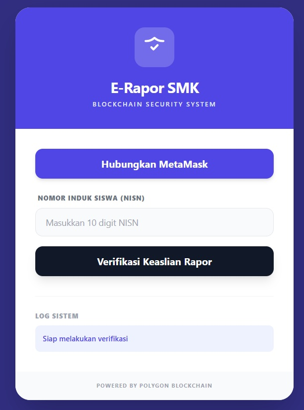

# 🎓 E-Rapor SMK Berbasis Blockchain
<p align="center">
  
</p>
**Sistem Verifikasi Rapor Digital Terdesentralisasi untuk Integritas Nilai Siswa.**

[](https://polygon.technology/)
[](https://reactjs.org/)
[](https://nodejs.org/)
[](https://soliditylang.org/)

## 📝 Deskripsi Proyek
E-Rapor SMK Blockchain adalah platform inovatif yang dirancang untuk mengatasi masalah manipulasi nilai dan pemalsuan rapor fisik. Dengan memanfaatkan teknologi **Blockchain**, setiap data rapor yang diterbitkan akan memiliki sidik jari digital (*hash*) yang disimpan secara permanen di jaringan terdesentralisasi.

### Mengapa Menggunakan Blockchain?
- **Anti-Manipulasi:** Nilai yang sudah masuk ke blockchain tidak dapat diubah oleh siapa pun.
- **Verifikasi Instan:** Pihak kampus atau perusahaan dapat memverifikasi keaslian rapor tanpa perlu menghubungi sekolah secara manual.
- **Transparansi:** Rekam jejak akademik siswa tercatat secara aman dan transparan.

---

## 🚀 Fitur Utama
- ✅ **Dashboard Modern:** Antarmuka responsif dengan Tailwind CSS.
- 🦊 **Integrasi MetaMask:** Otentikasi menggunakan dompet digital untuk keamanan tingkat tinggi.
- 🛡️ **Verifikasi Real-time:** Pencocokan hash rapor langsung ke Smart Contract.
- 📊 **Immutable Record:** Data disimpan secara permanen di jaringan Polygon (Testnet).

---

## 🛠️ Tech Stack
| Bagian | Teknologi |
| --- | --- |
| **Frontend** | React.js, Tailwind CSS, Ethers.js |
| **Backend** | Node.js, Express, Crypto |
| **Blockchain** | Solidity, Hardhat, Polygon Network |
| **Storage** | IPFS (rencana pengembangan) |

---

## 📦 Struktur Folder
```text
.
├── frontend/        # Aplikasi React (Antarmuka Pengguna)
├── backend/         # API untuk pemrosesan hash nilai
├── smart-contract/  # Kode Solidity dan skrip deploy ke Blockchain
└── README.md
